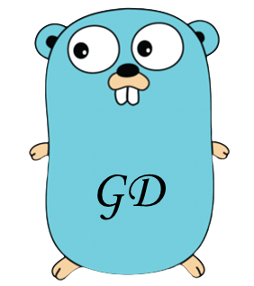

# godog []()

[](https://pkg.go.dev/github.com/chuck1024/gd@v1.7.17?tab=doc)
[](https://goreportcard.com/report/github.com/chuck1024/gd)
[](https://github.com/chuck1024/gd/tags)
[]()

"go" is the meaning of a dog in Chinese pronunciation, and dog's original intention is also a dog. So godog means "狗狗"
in Chinese, which is very cute.


---

## Author

```
author: Chuck1024
email : bpmf.9527@gmail.com
```

---

## Installation

Start with cloning gd:

```
> go get github.com/chuck1024/gd
```

---

## Introduction

Godog is a basic framework implemented by golang, which is aiming at helping developers setup feature-rich server
quickly.

The framework contains `config module`,`databases module`,`error module`,`dlog module`,`net module`,`runtime module`
and `server module`. You can select any modules according to your practice. More features will be added later. I hope
anyone who is interested in this work can join it and let's enhance the system function of this framework together.

> * [gin](https://github.com/gin-gonic/gin) and [zookeeper](https://github.com/samuel/go-zookeeper) are third-party library and more third-party library in go.mod.
>* Authors are [**Gin-Gonic**](https://gin-gonic.com/) and [**Samuel Stauffer**](https://github.com/samuel).Thanks for them here.

---

## Quick start

```go
package main

import (
	"github.com/chuck1024/gd"
	"github.com/chuck1024/gd/net/dhttp"
	"github.com/chuck1024/gd/runtime/inject"
	"github.com/gin-gonic/gin"
	"net/http"
)

func HandlerHttp(c *gin.Context, req interface{}) (code int, message string, err error, ret string) {
	gd.Debug("httpServerTest req:%v", req)
	ret = "ok!!!"
	return http.StatusOK, "ok", nil, ret
}

func main() {
	d := gd.Default()
	inject.RegisterOrFail("httpServerInit", func(g *gin.Engine) error {
		r := g.Group("")
		r.Use(
			dhttp.GlFilter(),
			dhttp.GroupFilter(),
			dhttp.Logger("quick-start"),
		)

		d.HttpServer.GET(r, "test", HandlerHttp)

		if err := d.HttpServer.CheckHandle(); err != nil {
			return err
		}
		return nil
	})

	gd.SetConfig("Server", "httpPort", "10240")

	if err := d.Run(); err != nil {
		gd.Error("Error occurs, error = %s", err.Error())
		return
	}
}
```

---
**[config]**  
So far, it only supports configuration with ini in gd. Of course, it supports more and more format configuration in
future. What's more, your configuration file must have the necessary parameters, like this:

```ini
[Log]
enable = true
level = "DEBUG"

[Process]
maxCPU = 2
healthPort = 9527

[Server]
serverName = "gd"
httpPort = 10240
rpcPort = 10241
grpcPort = 10242
```

**Log.enable**: log config, turn on log output.
**Log.level**: log level.
**Process.maxCPU**: a limit of CPU usage. 0 is default, means to use half cores.  
**Process.maxMemory**: a limit of memory usage.
**Process.healthPort**: the port for monitor. If it is 0, monitor server will not run.
**Server.serverName**: server name.  
**Server.httpPort**: http port. If it is 0, http server will not run.   
**Server.rpcPort**: rpc port. If it is 0, rpc server will not run.
**Server.grpcPort**: grpc port. If it is 0, grpc server will not run.

Those items mentioned above are the base need of a server application. And they are defined in config file:
sample/conf/conf.json.

---
**[net]**  
provides golang network server, it is contain http server and rpc server. It is a simple demo that you can develop it on
the basis of it. I will import introduce rpc server. Focus on the rpc server.

```go
type Packet interface {
	ID() uint32
	SetErrCode(code uint32)
}

default rpc packet:
type RpcPacket struct {
	Seq       uint32
	ErrCode   uint32
	Cmd       uint32 // also be a string, for dispatch.
	PacketLen uint32
	Body      []byte
}

gd rpc packet:
type DogPacket struct {
	Header
	Body []byte
}

type Header struct {
	PacketLen uint32
	Seq       uint32
	Cmd       uint32
	CheckSum  uint32
	ErrCode   uint32
	Version   uint8
	Padding   uint8
	SOH       uint8
	EOH       uint8
}
```

The Packet is a interface in rpc server and client. So, you can make your protocol that suits yourself by implementing
packet's methods, if you need. You add new RpcPacket according to yourself rule. DogPacket is a protocol that is used by
author. Of course, the author encourages the use of DogPacket.

---
**[service]**  
provides service register and discovery. Load balancing will be provided in the future. Service discovery registration
based on etcd and zookeeper implementation.

```go
register :
type DogRegister interface {
    Start() error
    Close()
    SetRootNode(node string) error
    GetRootNode() (root string)
    SetHeartBeat(heartBeat time.Duration)
    SetOffline(offline bool)
}

discovery:
type DogDiscovery interface {
    Start() error
    Close()
    Watch(key, node string) error
    WatchMulti(nodes map[string]string) error
    AddNode(key string, info service.NodeInfo)
    DelNode(key string, addr string)
    GetNodeInfo(key string) (nodesInfo []service.NodeInfo)
}

nodeInfo:
type NodeInfo interface {
	GetIp() string
	GetPort() int
	GetOffline() bool
	GetWeight() uint64
}

type DefaultNodeInfo struct {
	Ip      string `json:"ip"`
	Port    int    `json:"port"`
	Offline bool   `json:"offline"`
	Weight  uint64 `json:"weight"`
}
```

The DogRegister and DogDiscovery are interface, gd supports zookeeper and etcd, so you can use others. The NodeInfo is
info of node.

---

## Usage

This example simply demonstrates the use of the gd. of course, you need to make conf.json in conf Folder. The example
use service discovery with etcd. So, you can install etcd in your computer. Of course, you can choose to comment out
these lines of code.

server:

```go
package main

import (
 "context"
 "github.com/chuck1024/gd"
 de "github.com/chuck1024/gd/derror"
 "github.com/chuck1024/gd/net/dhttp"
 "github.com/chuck1024/gd/net/dogrpc"
 "github.com/chuck1024/gd/runtime/inject"
 pb "github.com/chuck1024/gd/sample/helloworld"
 "github.com/gin-gonic/gin"
 "google.golang.org/grpc"
 "net/http"
)

type TestReq struct {
	Data string
}

type TestResp struct {
	Ret string
}

func HandlerHttpTest(c *gin.Context, req *TestReq) (code int, message string, err error, ret *TestResp) {
	gd.Debug("httpServerTest req:%v", req)
	
	ret = &TestResp{
		Ret: "ok!!!",
	}

	return http.StatusOK, "ok", nil, ret
}

func HandlerRpcTest(req *TestReq) (code uint32, message string, err error, ret *TestResp) {
	gd.Debug("rpc sever req:%v", req)
	
	ret = &TestResp{
		Ret: "ok!!!",
	}

	return uint32(de.RpcSuccess), "ok", nil, ret
}

type reg struct {
	handler pb.GreeterServer
}

func (r *reg) RegisterHandler(s *grpc.Server) error {
	pb.RegisterGreeterServer(s, r.handler)
	return nil
}

// server is used to implement hello world.GreeterServer.
type server struct{}

// SayHello implements hello world.GreeterServer
func (s *server) SayHello(ctx context.Context, in *pb.HelloRequest) (*pb.HelloReply, error) {
	return &pb.HelloReply{Message: "Hello " + in.Name}, nil
}

func Register(e *gd.Engine) {
 // http 
	inject.RegisterOrFail("httpServerInit", func(g *gin.Engine) error {
		r := g.Group("")
		r.Use(
			dhttp.GlFilter(), 
			dhttp.StatFilter(), 
			dhttp.GroupFilter(), 
			dhttp.Logger("sample"), 
		)
		
		e.HttpServer.POST(r, "test", HandlerHttpTest)
		
		if err := e.HttpServer.CheckHandle(); err != nil {
			return err
		}
		return nil
 })
	
	// Rpc 
	inject.RegisterOrFail("register", &register.EtcdRegister{})
	e.RpcServer.AddDogHandler(1024, HandlerRpcTest)
	if err := e.RpcServer.DogRpcRegister(); err != nil {
		gd.Error("DogRpcRegister occur error:%s", err)
		return
	}
	dogrpc.Use([]dogrpc.Filter{&dogrpc.GlFilter{}, &dogrpc.LogFilter{}})
	
	// grpc 
	inject.RegisterOrFail("registerHandler", &reg{handler: &server{}})
}

func main() {
	d := gd.Default()
	
	Register(d)
	
	err := d.Run()
	if err != nil {
		gd.Error("Error occurs, error = %s", err.Error())
		return
	}
}

// you can use command to test http service.
// curl -X POST http://127.0.0.1:10240/test -H "Content-Type: application/json" --data '{"Data":"test"}'
```

> * You can find it in "sample/service.go"
>* use `control+c` to stop process

rpc client:

```go
package main

import (
	"fmt"
	"github.com/chuck1024/gd"
	"github.com/chuck1024/gd/dlog"
	"github.com/chuck1024/gd/service/discovery"
	"time"
)

func main() {
	defer dlog.Close()
	c := gd.NewRpcClient(time.Duration(500*time.Millisecond), 0)
	// discovery
	var r discovery.DogDiscovery

	r = &discovery.EtcdDiscovery{}
	if err := r.Start(); err != nil {
		dlog.Error("err:%s", err)
		return
	}

	if err := r.Watch("test", "/root/github/gd/prod/pool"); err != nil {
		dlog.Error("err:%s", err)
		return
	}
	time.Sleep(100 * time.Millisecond)

	hosts := r.GetNodeInfo("test")
	for _, v := range hosts {
		dlog.Debug("%s:%d", v.GetIp(), v.GetPort())
	}

	// you can choose one or use load balance algorithm to choose best one.
	// or put all to c.Addr
	for _, v := range hosts {
		if !v.GetOffline() {
			c.AddAddr(fmt.Sprintf("%s:%d", v.GetIp(), v.GetPort()))
		}
	}

	body := &struct {
		Data string
	}{
		Data: "How are you?",
	}

	code, rsp, err := c.DogInvoke(1024, body)
	if err != nil {
		dlog.Error("Error when sending request to server: %s", err)
	}

	// or use rpc protocol
	//rsp, err = c.Invoke(1024, body)
	//if err != nil {
	//t.Logf("Error when sending request to server: %s", err)
	//}

	dlog.Debug("code=%d,resp=%s", code, string(rsp))
}
```

> * It contained "sample/rpc_client.go"

---
`net module` you also use it to do something if you want to use `net module` only. Here's how it's used.

`rpc_server` show how to start rpc server

```go
package dogrpc_test

import (
	"github.com/chuck1024/gd/net/dogrpc"
	"testing"
)

func TestRpcServer(t *testing.T) {
	var i chan struct{}
	d := dogrpc.NewRpcServer()
	d.Addr = 10241
	// Tcp
	d.AddHandler(1024, func(req []byte) (uint32, []byte) {
		t.Logf("rpc server request: %s", string(req))
		code := uint32(0)
		resp := []byte("Are you ok?")
		return code, resp
	})

	err := d.Start()
	if err != nil {
		t.Logf("Error occurs, derror = %s", err.Error())
		return
	}
	<-i
}

```

> * You can find it in "net/dogrpc/rpc_server_test.go"

`rpc_client`show how to call rpc server

```go
package dogrpc_test

import (
	"github.com/chuck1024/gd"
	"github.com/chuck1024/gd/utls/network"
	"testing"
	"time"
)

func TestRpcClient(t *testing.T) {
	c := gd.NewRpcClient(time.Duration(500*time.Millisecond), 0)
	c.AddAddr(network.GetLocalIP() + ":10241")

	body := []byte("How are you?")

	code, rsp, err := c.Invoke(1024, body)
	if err != nil {
		t.Logf("Error when sending request to server: %s", err)
	}

	t.Logf("code=%d, resp=%s", code, string(rsp))
}

```

> * You can find it in "net/dogrpc/rpc_client_test.go"

---
`derror module` provides the relation usages of error. It supports the structs of CodeError which contains code, error
type, and error msg.

```go
package derror

type CodeError struct {
	errCode int
	errType string
	errMsg  string
}

var (
	RpcSuccess             = 0
	Success                = 200
	BadRequest             = 400
	Unauthorized           = 401
	Forbidden              = 403
	NotFound               = 404
	SystemError            = 500
	ParameterError         = 600
	DBError                = 701
	CacheError             = 702
	RpcTimeout             = 10001
	RpcOverflow            = 10002
	RpcInternalServerError = 10003
	RpcInvalidParam        = 10004
	UnknownError           = "unknown error"

	ErrMap = map[int]string{
		RpcSuccess:             "ok",
		Success:                "ok",
		BadRequest:             "bad request",
		Unauthorized:           "Unauthorized",
		Forbidden:              "Forbidden",
		NotFound:               "not found",
		SystemError:            "system error",
		ParameterError:         "Parameter error",
		DBError:                "db error",
		CacheError:             "cache error",
		RpcTimeout:             "timeout error",
		RpcOverflow:            "overflow error",
		RpcInternalServerError: "interval server error",
		RpcInvalidParam:        "invalid param",
	}
)

// get derror type. you can also add type to ErrMap.
func GetErrorType(code int) string {
	t, ok := ErrMap[code]
	if !ok {
		t = UnknownError
	}
	return t
}
```

---
`service module`
> * if you use etcd, you must download etcd module
>* `go get go.etcd.io/etcd/client/v3`
>* you can find it usage on "server/register/register_test.go" and "server/discovery/discovery.go"

```go
package main

import (
	"github.com/chuck1024/gd/dlog"
	"github.com/chuck1024/gd/service/register"
)

func etcd(){
	var r register.DogRegister
	r = &register.EtcdRegister{}
	if err := r.Start(); err != nil {
		dlog.Error("err:%s", err)
		return
	}
}

func zk(){
	var r register.DogRegister
	r = &register.ZkRegister{}
	if err := r.Start(); err != nil {
		dlog.Error("err:%s", err)
		return
	}
}

func main(){
	defer dlog.Close()
	etcd()
}
```

```go
package main

import (
	"github.com/chuck1024/gd/dlog"
	"github.com/chuck1024/gd/service/discovery"
	"time"
)

func etcdDis() {
	var r discovery.DogDiscovery

	r = &discovery.EtcdDiscovery{}
	if err := r.Start(); err != nil {
		dlog.Error("err:%s", err)
		return
	}

	r.Watch("test", "/root/github/gd/prod/pool")
	time.Sleep(100 * time.Millisecond)

	n1 := r.GetNodeInfo("test")
	for _, v := range n1 {
		dlog.Info("%s:%d", v.GetIp(), v.GetPort())
	}
}

func zkDis() {
	var r discovery.DogDiscovery
	r = &discovery.ZkDiscovery{}
	if err := r.Start(); err != nil {
		dlog.Error("err:%s", err)
		return
	}

	r.Watch("test", "/root/github/gd/prod/pool")

	time.Sleep(100 * time.Millisecond)
	n1 := r.GetNodeInfo("test")
	for _, v := range n1 {
		dlog.Info("%s:%d", v.GetIp(), v.GetPort())
	}
}

func main() {
	defer dlog.Close()
	etcdDis()
}
```

---
PS: More information can be obtained in the source code

---

## License

gd is released under the [**MIT LICENSE**](http://opensource.org/licenses/mit-license.php).  
